<!-- @import "[TOC]" {cmd="toc" depthFrom=1 depthTo=6 orderedList=false} -->

<!-- code_chunk_output -->

- [VSCode for openEuler Globalization](#vscode-for-openeuler-globalization)
  - [安装软件和扩展](#安装软件和扩展)
  - [VSCode 界面和 Git](#vscode-界面和-git)
    - [打开本地仓](#打开本地仓)
    - [资源管理器](#资源管理器)
    - [搜索](#搜索)
    - [源代码管理](#源代码管理)
  - [其他常用操作和扩展](#其他常用操作和扩展)

<!-- /code_chunk_output -->

# VSCode for openEuler Docs Globalization

Visual Studio Code（简称 VSCode）是由微软开发的轻量级代码编辑器，支持包括 Markdown 在内的多种语言和格式，内置了命令行工具和 Git 版本控制系统。VSCode 中很多操作可以通过软件内命令行来使用，呼出软件内命令行的默认快捷键是 **F1** 或 **Ctrl+Shift+P**，请牢记。如无特殊说明，本文中的命令均为软件内命令行的命令。

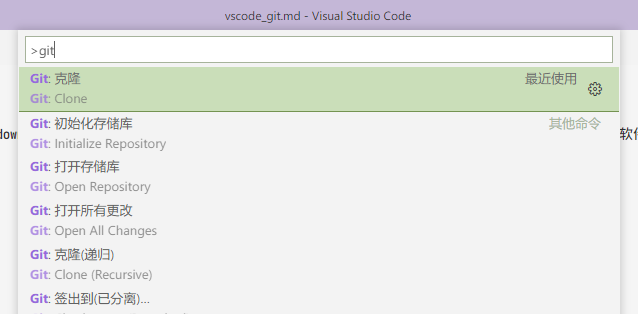

---

## 安装软件和扩展

1. 安装并配置好 Git。
2. [下载](https://code.visualstudio.com/download)安装 VSCode。
3. 可安装中文语言包，语言包在扩展商店中以扩展的形式提供。要打开扩展商店：
   点击左侧边栏的扩展图标，或
   快捷键 **Ctrl+Shift+X**，或
   呼出命令行，输入 `>extensions: install extensions` 以命令打开。

   > VSCode 软件内命令行一般不需要输入完整命令，可输入 `>extensions` 或 `>install extensions` 之后用键盘上下键选择命令补全。
   >

   > 可以输入中文命令描述。
   >

   

   点击[安装]按钮即可安装，点击项目可进入商店页面查看详情。
4. 安装 GitLens 扩展，用于 Git 相关操作。

---

## VSCode 界面和 Git

为方便解说 UI 内容，先将 Gitee 仓库用 VSCode 打开，这里假定你已经把 openEuler/docs 仓 fork 到了自己的远程仓，并且 `>git: clone` 或用 git bash clone 到了本地计算机上：

### 打开本地仓

在 VSCode 中用 `>git: clone` 克隆完成后会提示是否打开。如果是用 git bash clone 的本地仓：
在 Windows 资源管理器中打开本地仓所在文件夹，右键菜单**通过 Code 打开**，或
在 VSCode 中点击**文件**>**打开文件夹**，或
`>File: Open Folder`

### 资源管理器

**资源管理器**页，即左侧边栏的第一项。打开本地仓后的界面如图所示：
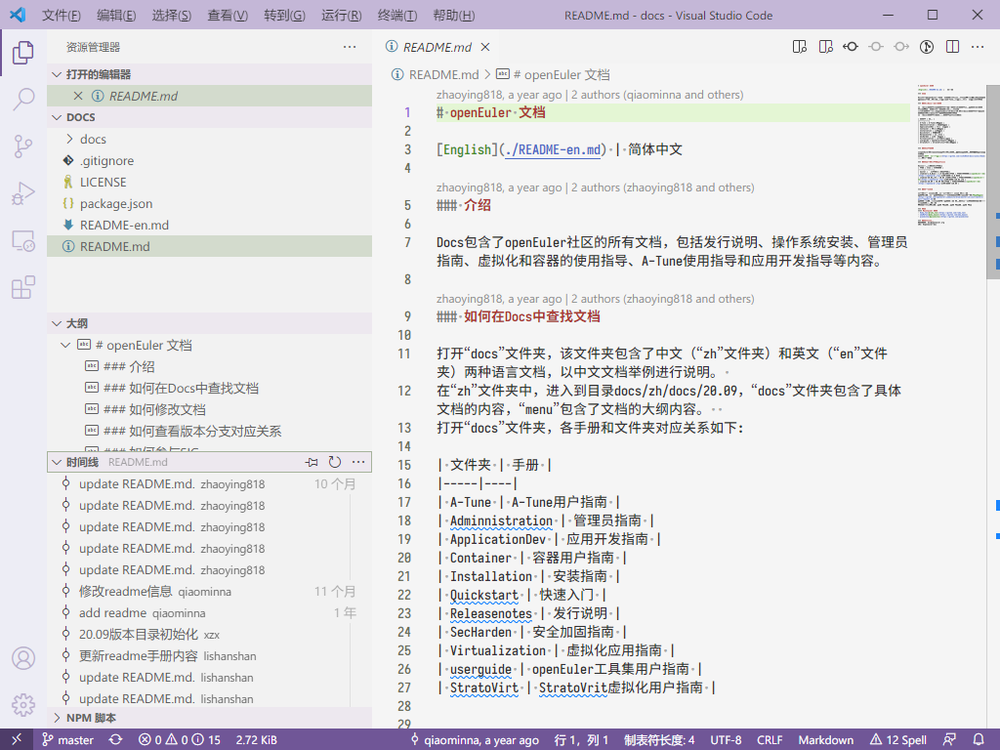
图中已经点击预览了 README.md。单击是预览文件，文件名在**打开的编辑器**中显示为斜体；双击是打开文件，文件名不显示斜体。预览时做任何改动也会打开文件。

右下角显示 **Markdown** 处可以点击更改语言模式，如果编辑器没有自动检测到 Markdown 语法可以手动选择。
查看（预览或打开）文件时，时间线会显示当前文件的提交历史，底栏会显示光标当前所在行的作者和提交时间。点击时间线中任意提交历史可以比较查看当前文件在本次提交中的改动。
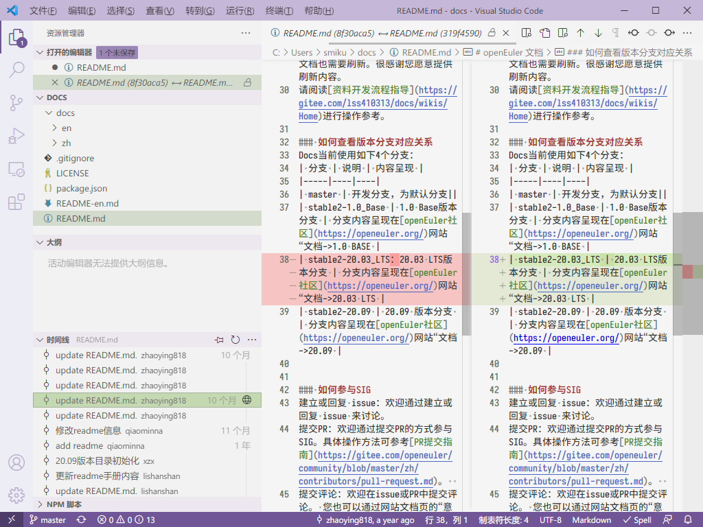
上图中我在 README.md 中做了改动但没有保存，文件名前会加上圆点图标，并且有文字提示 1 个未保存。

如要对比本地的两个文件，在文件树（即图中 **DOCS**）或打开的编辑器中右键点击一个文件**选择以进行比较**，再右键另一个文件**与已选项目进行比较**，或者按住 **Ctrl** 选择两个文件**将已选项进行比较**。改动后未保存的文件也可以与已保存的版本比较。

文件树中可以进行新建文件/文件夹、复制粘贴、重命名等常规操作。
在资源管理器页，按 **Ctrl+E** 可以在文件树中以文件名或路径进行搜索。
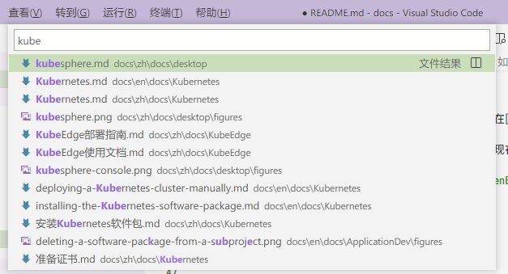

打开的编辑器中按 **F3** 或 **Ctrl+F** 搜索，**Ctrl+H** 替换。搜索栏的输入框右侧可以启用区分大小写、全字匹配、正则匹配。

同时打开多个文件时，可以按住文件标签拖动到左右侧，在侧边栏打开，方便中英文对照。
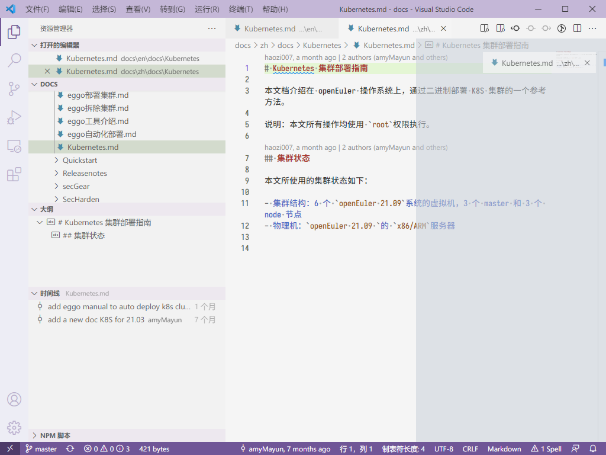

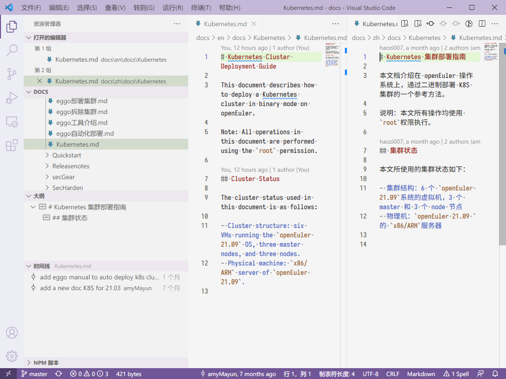
编辑 Markdown 文件时，VSCode 提供自带的预览查看器，按 **Ctrl+Shift+V** 调出。预览窗口也可以拖动到侧边栏打开。

### 搜索

**Ctrl+Shift+F** 可以快速打开**搜索**页。
全局搜索当前文件树的文件内容。
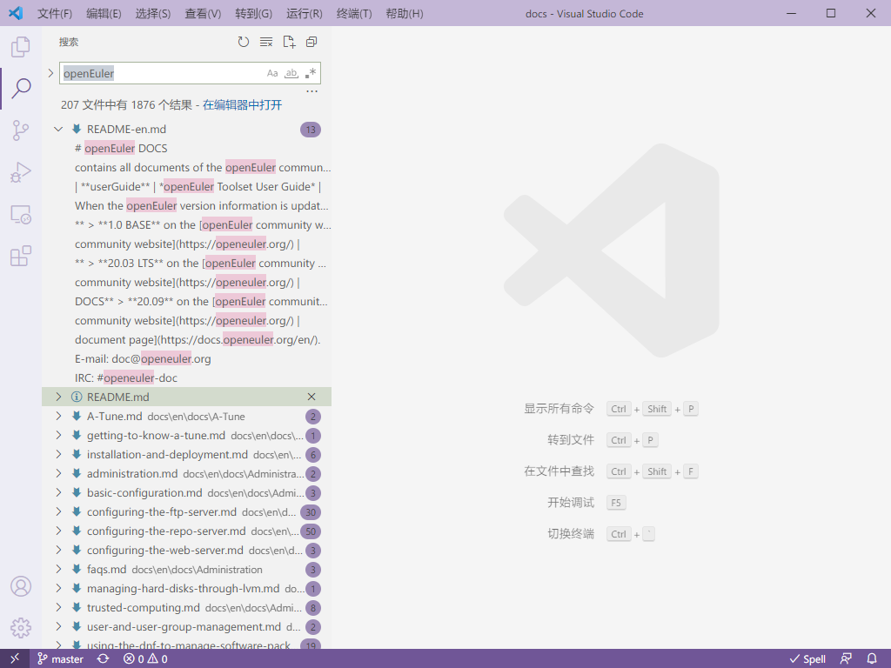

### 源代码管理

**源代码管理**页如图所示。
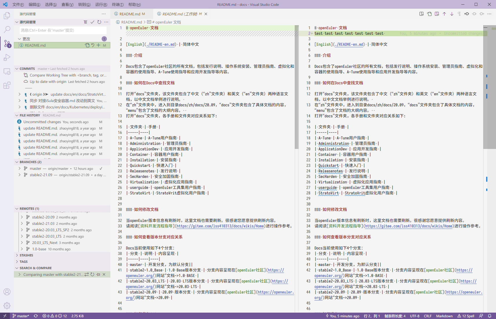
在编辑器中更改并保存文件后，有改动的文件会出现在**更改**中。点击这里的文件可以显示对比，即本地最新的文件与最后一次拉取的文件对比。
在**更改**文件树中的文件名右侧点击 **+** 号将文件放入暂存区。等效于对当前文件使用 `>git: stage changes` 命令。
也可以 **Ctrl**+左键多选文件后点击 **+** 批量放入暂存区。命令 `>git:stage all changes` 可以把所有更改的文件放入暂存区。
点击暂存区中文件名右侧的 **-** 可以移出暂存区。
要提交暂存区中的文件，按**源代码管理**项下输入框中的提示，输入提交信息按 **Ctrl+Enter** 提交。等效于 `>git: commit staged`。
未暂存的文件可以使用 `>git: commit` 或 `>git: commit all` 提交，确认后文件可跳过暂存直接提交。
提交的文件存放于本地的 HEAD 文件中，还未发布到远端库。可以使用 `>git: undo last commit` 撤消最后一次提交。
提交后，窗口左下角会显示提交的数量，可以点击此处发布到远端库（同时会拉取远端库的新提交）。如果要只发布而不拉取，可以使用 `>git: push`。**如果显示远端库有新提交，先拉取至本地，以免提交后产生冲突**。
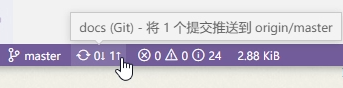

**COMMITS** 项显示当前分支中的所有提交历史。点击提交项可以展开显示更改的文件，点击文件可以显示与上个版本比较的改动。
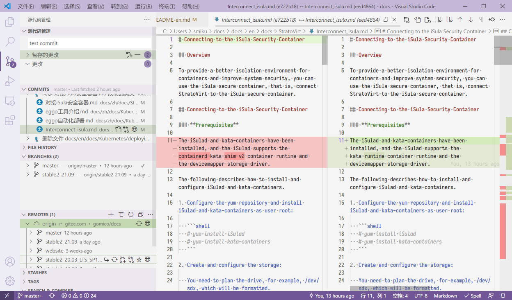

**FILE HISTORY** 即编辑器中当前打开文件的提交历史，类似于资源管理器页中的时间线。

**BRANCHES** 显示本地分支中的提交。参见下文 **REMOTES**。

**REMOTES** 显示远端库中所有分支的提交。右键选择 **Switch to Branch...** 切换到另一分支，并将这个分支保存到本地，显示在 **BRANCHES** 中。点击左下此处也可以切换分支。
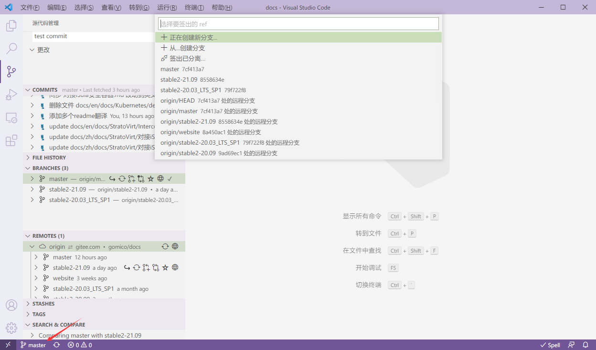

**STASHES** 储藏区。修改后的文件如果不满意，不想放在本次提交里，可以 `>git: stash` 先放入储藏区。

**TAGS** 列出每个标签对应的提交。

**SEARCH & COMPARE** 提供搜索提交和比较分支的功能。**Search Commits...** 可以选择按消息内容、作者、文件等搜索。**Compare References...** 可以选中两个分支进行比较，提交比较和文件树比较。文件树比较会显示文件路径变化，以及内容有差异的同名文件。

创建图中的比较时，先选择了 master 分支（显示在右侧），再选择了 stable2-21.09 分支（显示在左侧）。
文件树中 **-** 号表示在右侧分支中缺少的文件，**+** 号表示右侧分支中多出的文件，**±** 表示同名文件内容有差异。

---

## 其他常用操作和扩展

`>preference: color theme`
更改界面颜色主题。更多颜色主题在扩展商店中以扩展的形式提供。商店搜索 category:themes 列出所有颜色主题和图标主题。

**文件**>**将工作区另存为** 可以把当前工作的文件夹（库）保存为文件，避免以后打开需要再寻找文件夹路径。
编辑器中可以设置**多个光标**。按住 **Alt** 用左键每次点击可以添加一个光标，或者按住鼠标中键跨行上下拖动。适合需要批量输入或删除内容的情况，比如批量删除行尾的句号、行首的缩进。
类似于多个光标的功能还有**批量选中**。如需要把全文的版本号 20.03 更改为 20.09，先选中任一 20.03，长按 **Ctrl+D** 选择全文的重复字串（或短按一次，增加选择一个字串），选中后输入 20.09 即可批量更改。
如果是正则表达式批量搜索到的字串，用 **Ctrl+Shift+L** 全部选中。

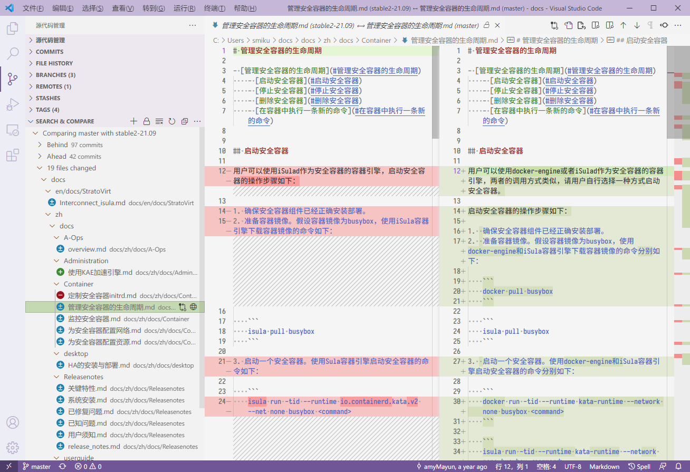

推荐安装扩展 Markdown Editor (zaaack.markdown-editor)，支持所见即所得模式和分屏预览模式的 Markdown 编辑器。
推荐安装扩展 Markdown Preview Enhanced (shd101wyy.markdown-preview-enhanced)，增强 Markdown 预览功能，快捷方式同样为 **Ctrl+Shift+V**，覆盖 VSCode 自带的预览查看器。安装后如果需要使用自带的预览查看器，在编辑器窗口顶端的文件标签上右键 -> 打开预览。自带的查看器中，双击句段可以跳转到原文相应句子。

> 自动生成 TOC：>markdown preview enhanced: create toc （需要保持预览窗口打开）

Spellright (ban.spellright) 英语拼写检查扩展。需要在 Windows 设置里添加英语（时间和语言 -> 语言 -> 首选语言）。

推荐 VSCode 设置：editor.renderWhitespace 和 editor.wordWrap。
